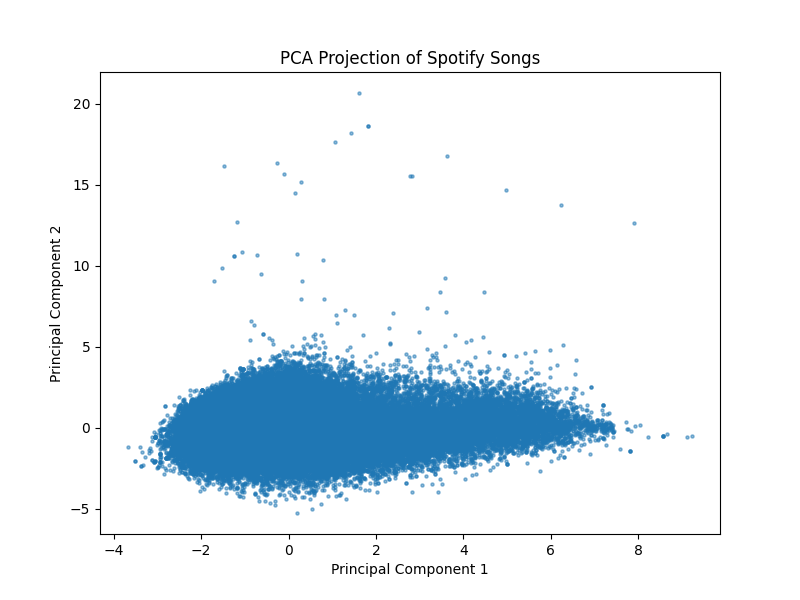
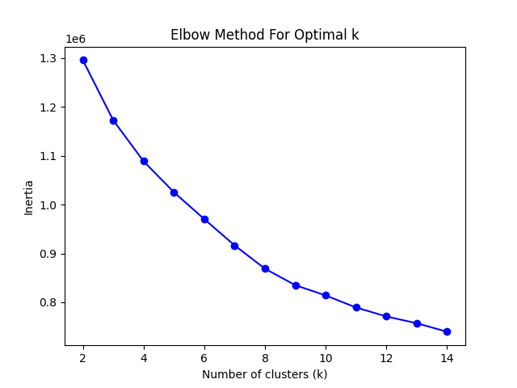
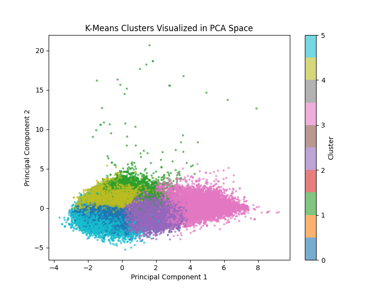
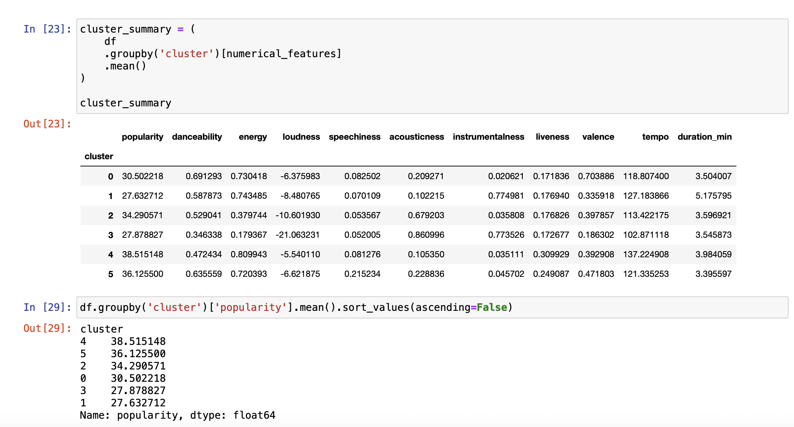

### Determining-Spotify-Song-Attributes-Relationships-to-Their-Popularity

**Joshua Huang**

#### Executive summary

#### Rationale
From a business standpoint, being able to determine specific groupings that correlate to popularity allows Spotify to give better recommendations for users based on said groupings, which would similarly make it more reliable as a music interface and in turn more attractive for paying customers. More importantly however, determining the patterns and preferences of users would give people insight on what counts as attractive as music or songs. This would consequently give greater inspiration to others to explore these fields or perhaps explore less popular fields to showcase how great they can be as songs/music as well.

#### Research Question
The main key point we attempt to answer is if we can cluster and organize songs' audio features together in a graphical manner such that we can identify specific hidden groupings and patterns such as song style or genre preferences across the popularity of multiple Spotify songs.

#### Data Sources

The following will be my main source of data:

https://www.kaggle.com/datasets/maharshipandya/-spotify-tracks-dataset

It contains a list 114,000 rows of different songs and their popularity from Spotify. Including popularity ranking, each song has 20 columns of features such as artists, album name, energy, key, etc. 

#### Methodology

The main techniques expected to be utilized for this project include data cleaning, feature engineering, pipelining, clustering, and graphing. I expect a lot of cleaning and engineering will be needed to transform the dataset above to a usable state for clustering. Similar, pipelining alone with column transformers will be useful here to aid with the transformation state of the input data. Finally of course, I aim to cluster these features together to see which groups will be focused upon, with some graphing techniques to help visualize these results.

#### Expectations

I expect a large relationship with artists in general for each song, where popularity would be matched with certain artists as well. I also similarly expect certain genres or musical styles to be more popular than others. Aside from this however, I'm not as certain with expected results, as the clustering may come up with some unexpected groupings.

#### Preparation

First a basic eda was performed on the dataset. The head of the dataset was displayed and the dtypes per column were checked before checking on null values which were not found in either the target column ("popularity") nor the features of major interest (energy, key, valence, etc.). Visualizations of chosen feature variables of interest were then created to examine distribution of variables, correlation to each other, and correlation to the popularity column. These chosen features were:

- danceability
- energy
- valence
- tempo
- loudness
- accousticness

These features were chosen simply because they stood out to me in relation to popularity while also being specific attributes of a song. 

First histograms were ran on each feature to determine their spread and aggregations. Tempo was the most normal distribution bell curve between 0 - 250, followed by valence ranging between 0 - 1.0 (though it had a higher ceiling where most of its bars were large in count). Danceabiltiy was normal but slightly left skewed between 0 - 1.0, and loudness was skewed left between -50 to 0. The most extreme distribution were energy and acousticness, where accoustiness was extremely skewed right and energy was left skewed but bars would constantly increase from 0 to 1.0.

Next we made a heatmap of these features that focused on their correlation with each other. This was to see if certain features may get compounded together if one of them is influential on popularity. Aside from a select few combinations, most correlation tended to be on the lower side and not passing the absolute 0.5 threshold. The main exceptions were energy and loudness at 0.76, energy and acoustiness at -0.73, and loudness and accoustiness at -0.59. These relationships make sense, since high energy resonates with louder music, and high energy and loud music often involves metal or electric music which cuts the naturalness of music accoustiness.

Finally, we made a multi scatterplot where we compared each feature against popularity to determine if there's a trend. No major trend was identifiable with danceability, energy, valence, or tempo. There was a slight trend where larger loudness lead to better popularity and higher accoustiness lead to lower popularity but the values were to spread out to truly make note of this. 

Finally, a basic linear regression model was made to predict popularity using the rest of the dataset features. Each feature was pass through a transformer which, transformed boolean to numerical values, ran a standard scaler on numerical values and a one hot encoder on the categorical values. From there, the train dataset was tranformed and fitted upon before predicting the test dataset. From there, we took the coefficients of the model and see which features were most useful for compatability with popularity. Features with the largest coeffiecent values included:

- time signature
- key
- duration_min

the rest of the features had much lower coefficients utilized on the model. Of course this is a very barebones basic model but we'll keep an eye out for these features during the clustering.

In preparation of the clustering, we run the full dataset under a similar transformation manner as we did with the basic linear regression model, where numerical features were ran under a standard scaler and categorical features were ran under a one hot encoder. The main difference is of course this time the "popularity" column is similar transformed in preparation of clustering. Our final transformed result gives us a dataframe with 114000 rows and 30 columns. Just to recheck, we also have 0 nan values in this frame.

### Dimensional Reductions, Final Steps, and Clustering

Before any next steps, a PCA is ran on the transformed dataset to determine a good sense of how much of the variance is explained by the number of components utilized on the projection of the PCA. In this case, utilizing 2 components explains 33.47% of the projection, a good sign that clustering will work upon here. We also plot the projection to confirm no major early groupings and the existing outliers that occur:

(we do also plot a variance curve for further interest in the final report but we don't further explore here)

Following the PCA, we decide to check the best k for the clustering method of "K means" against inertia based around the point of elbow or most sudden change:

The k that falls under this definition is around "6" which we utilize for our k variable in our clusters:

Additional, we predict the clusters for each song previously listed and get statistics about their numerical features along with ranking popularity of the clusters:

#### Results

The cluster with the highest popularity here was cluster 4. This cluster had high energy (0.81), high loudness (-5.54), a quick tempo (137) along with low accoustiness (0.11) and moderate danceability. The cluster here relates to high energy, fast paced songs such as pop or hype music which explains the ranking of popularity here as they are very mainstream and radio friendly.

Following this, we have cluster 5 which is similar to 4 in its loudness and energy but has an increase in speechability, a moderate tempo and a decently high danceability. Based on this information, the cluster here has a high reference to rap or pop dance songs which fall under this description and are also quite mainstream as well.

Cluster 2 ranked 3rd in our popularity rankings. This cluster showcased a focus in lower energy but higher accoustiness along with a moderate tempo and softer loudness. We can consider this group as more indie style songs, expressing more artistic freedom and hence less of the hype sounding tracks of previous. These are popular but not as mainstream as the other 2 so this ranking also makes sense.

Next on the list is cluster 0, represented with its high valence and danceability, along with the more moderate tempo. Songs of this nature that are upbeat and feel good leaning would fall into this cluster, and aren't fully mainstream (especially since this was more of a trend in the past) but still rather relavnt hence this more mid tier placement.

Near the end we have cluster 1 which contains particularly a high instrumental focus (0.77) along with a much longer duration vs the other clusters and a lower valence. This cluster represents the more somber and classical music archetype which is more on the niche side and less popular these days which definitely explains the cluster's ranking.

And finally we have cluster 3, demonstrated with an also high instrumental focus at 0.77 and the highest acousticness at 0.86, but also the least noise (-0.21) and energy (0.18) of all the clsuters (-0.21). We can label this cluster also in the more relaxing and quiet music, designed more around relaxation and easing nerves. This is also a more niche category so it's understandable why it's ranked last.

Over all, we were able to achieve our goal of creating clusters of song types that were able to identify and rank these clusters based on popularity as well.

#### Next steps
As mentioned, these clusters were created utilizing k means here. There are other cluster types we can analyze such as DBscans to pull out these results. Additionally, we utilized the mean of popularity for the rankings which are effectively by the outlier rankings. Further cleaning on this area could make clusters differentiate more in rankings. Finally, running more cluster groupings can help use identify more song groups and niches which may prove useful if more detail is required in the research.

#### Outline of project

- [EDA](https://github.com/rx-72/Determining-Spotify-Song-Attributes-Relationships-to-Their-Popularity/blob/main/EDA.ipynb)
- [Final](https://github.com/rx-72/Determining-Spotify-Song-Attributes-Relationships-to-Their-Popularity/blob/main/Capstone%20Project.ipynb)

##### Contact and Further Information

Joshua Huang
joh009@ucsd.edu
6262055665
